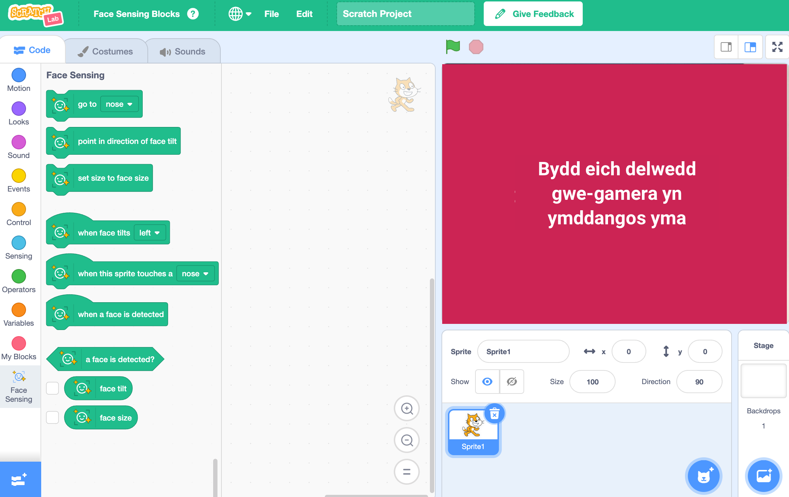

## Gosodwch y prosiect

<html>
  

    <iframe style="position: absolute; top: 0; left: 0; right: 0; width: 100%; height: 100%; border: none;" src="https://www.youtube.com/embed/aMfd06cIYrs?rel=0&cc_load_policy=1" allowfullscreen allow="accelerometer; autoplay; clipboard-write; encrypted-media; gyroscope; picture-in-picture; web-share"></iframe>
  

</html>

Mae'r prosiect hwn yn defnyddio fersiwn arbrofol arbennig o Scratch o'r enw Scratch Lab, sydd â rhai nodweddion ychwanegol.

\--- task ---

Agor [ Scratch Lab](https://lab.scratch.mit.edu/){:target="_blank"}.

Cliciwch ar **Face Sensing**.

\--- /task ---

\--- task ---

Cliciwch y botwm **Rhowch gynnig arni**.

\--- /task ---

\--- task ---

Os gofynnir i chi am ganiatâd i ddefnyddio'ch gwe-gamera, cliciwch ar **Caniatáu ar bob ymweliad**.

\--- /task ---

Dylech nawr weld fersiwn o Scratch gyda blociau arbennig `Face Sensing`{:class="block3extensions"}. Bydd yr olygfa o'ch gwe-gamera hefyd yn cael ei harddangos ar y Llwyfan.

