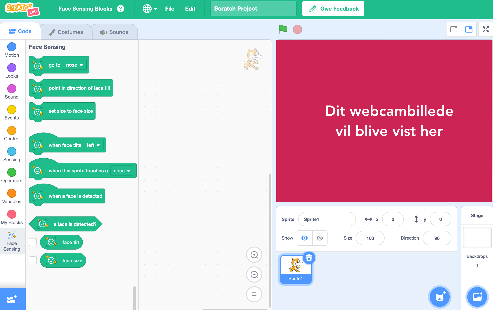

## Opsæt projektet

<html>
  

    <iframe style="position: absolute; top: 0; left: 0; right: 0; width: 100%; height: 100%; border: none;" src="https://www.youtube.com/embed/aMfd06cIYrs?rel=0&cc_load_policy=1" allowfullscreen allow="accelerometer; autoplay; clipboard-write; encrypted-media; gyroscope; picture-in-picture; web-share"></iframe>
  

</html>

Dette projekt bruger en særlig eksperimentel version af Scratch kaldet Scratch Lab, som har nogle ekstra funktioner.

--- task ---

Åbn [Scratch Lab](https://lab.scratch.mit.edu/){:target="_blank"}.

Klik på **Face Sensing**.

--- /task ---

--- task ---

Klik på knappen **Prøv det**.

--- /task ---

--- task ---

Hvis du bliver bedt om tilladelse til at bruge dit webcam, skal du klikke på **Tillad ved hvert besøg**.

--- /task ---

Du bør nu se en version af Scratch med specielle `Face Sensing`{:class="block3extensions"} blokke. Visningen fra dit webcam vil også blive vist på scenen.

