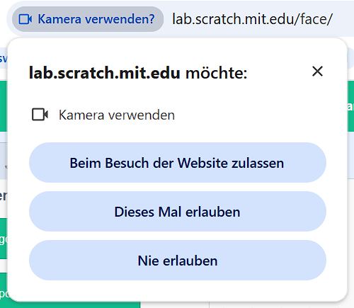
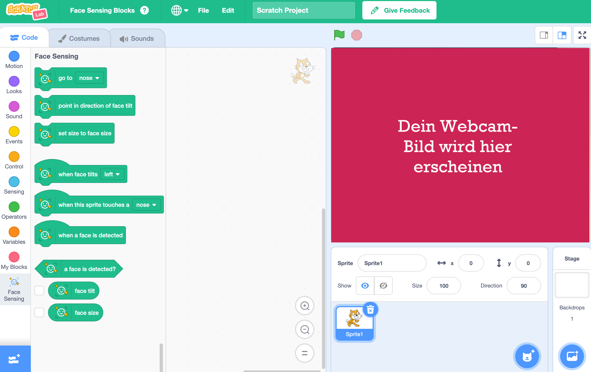

## Projekt einrichten

<html>
  

    <iframe style="position: absolute; top: 0; left: 0; right: 0; width: 100%; height: 100%; border: none;" src="https://www.youtube.com/embed/aMfd06cIYrs?rel=0&cc_load_policy=1" allowfullscreen allow="accelerometer; autoplay; clipboard-write; encrypted-media; gyroscope; picture-in-picture; web-share"></iframe>
  

</html>

Dieses Projekt verwendet eine spezielle experimentelle Version von Scratch namens Scratch Lab, die über einige zusätzliche Funktionen verfügt.

\--- task ---

Öffne [Scratch Lab](https://lab.scratch.mit.edu/){:target="_blank"}.

Klicke auf **Face Sensing** (Gesichtserkennung).

\--- /task ---

\--- task ---

Klicke auf den Button **Ausprobieren**.

\--- /task ---

\--- task ---

Wenn du um die Erlaubnis zur Verwendung deiner Webcam gebeten wirst, klicke auf **Beim Besuch der Webseite zulassen**.

\--- /task ---

Du solltest jetzt eine Version von Scratch mit speziellen `Gesichtserkennung`{:class="block3extensions"} Blöcken sehen. Die Ansicht deiner Webcam wird auch auf der Bühne angezeigt.

