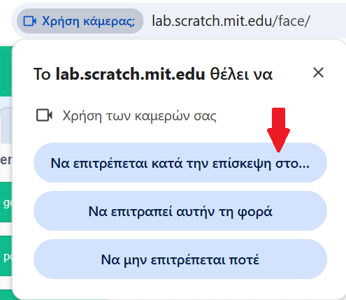
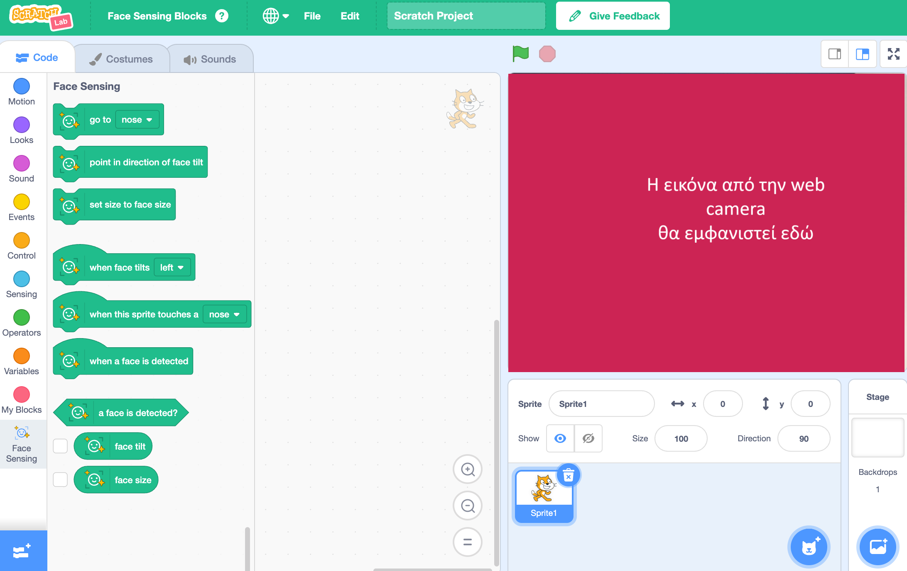

## Ρύθμιση του έργου

<html>
  

    <iframe style="position: absolute; top: 0; left: 0; right: 0; width: 100%; height: 100%; border: none;" src="https://www.youtube.com/embed/aMfd06cIYrs?rel=0&cc_load_policy=1" allowfullscreen allow="accelerometer; autoplay; clipboard-write; encrypted-media; gyroscope; picture-in-picture; web-share"></iframe>
  

</html>

Αυτό το έργο χρησιμοποιεί μια ειδική πειραματική έκδοση του Scratch που ονομάζεται Scratch Lab, η οποία έχει κάποιες επιπλέον δυνατότητες.

\--- task ---

Άνοιξε το [Scratch Lab](https://lab.scratch.mit.edu/){:target="_blank"}.

Κάνε κλικ στο **Face Sensing**.

\--- /task ---

\--- task ---

Κάνε κλικ στο κουμπί **Try it out**.

\--- /task ---

\--- task ---

Εάν σου ζητηθεί άδεια χρήσης της κάμερας web, κάνε κλικ στο **Να επιτρέπεται κατά την επίσκεψη**.

\--- /task ---

Θα πρέπει τώρα να δεις μια έκδοση του Scratch με ειδικά μπλοκ "Face Sensing"{:class="block3extensions"}. Η εικόνα από την κάμερα σου θα εμφανιστεί επίσης στη σκηνή.

