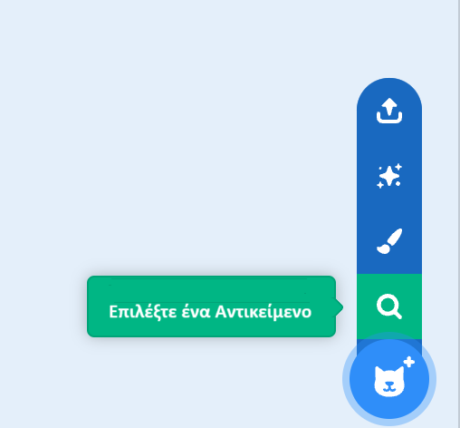

## Μετακίνησε το τυρί

<html>
  <div style="position: relative; overflow: hidden; padding-top: 56.25%;">
    <iframe style="position: absolute; top: 0; left: 0; right: 0; width: 100%; height: 100%; border: none;" src="https://www.youtube.com/embed/GIjNO1_LHNo?rel=0&cc_load_policy=1" allowfullscreen allow="accelerometer; autoplay; clipboard-write; encrypted-media; gyroscope; picture-in-picture; web-share"></iframe>
  </div>
</html>

Κάνε τα τυρογαριδάκια να κινούνται τυχαία στην οθόνη.

--- task ---

Διάγραψε το αντικείμενο γάτα.

--- /task ---

--- task ---

Πρόσθεσε ένα νέο αντικείμενο. Μπορείς να επιλέξεις ένα υπάρχον αντικείμενο, να ανεβάσεις μια εικόνα ή ακόμα και να ζωγραφίσεις το δικό σου αντικείμενο! Επιλέξαμε το αντικείμενο **Cheesy Puffs**.



--- /task ---

--- task --- 

Πρόσθεσε κώδικα για να μετακινήσεις το σντικείμενο σε τυχαίες θέσεις γύρω στην οθόνη:

```blocks3
when flag clicked
forever
glide (1) secs to (rτυχαία θέση v)
```

--- /task ---

--- task ---

**Δοκιμή:** Κάνε κλικ στην πράσινη σημαία και έλεγξε ότι το αντικείμενό σου μετακινείται τυχαία στην οθόνη σε διαφορετικά σημεία.

--- /task ---

