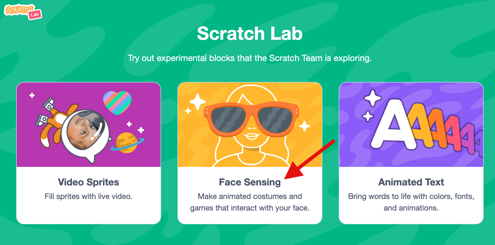

## Set up the project

This project uses a special experimental version of Scratch called 'Scratch Lab' which has some extra features.

--- task ---

+ Open [Scratch Lab](https://lab.scratch.mit.edu/){:target="_blank"}. 

--- /task ---

--- task ---

+ Click on 'Facial recognition'

--- /task ---