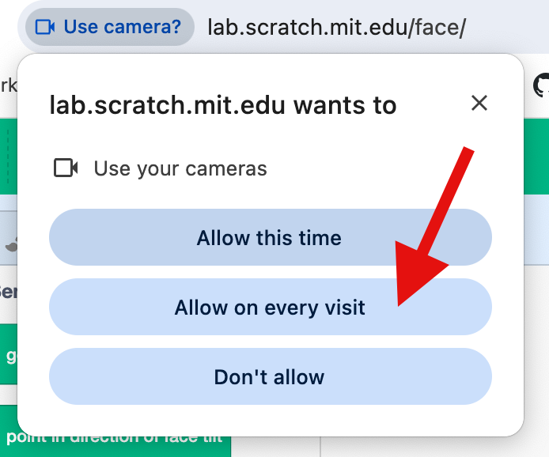
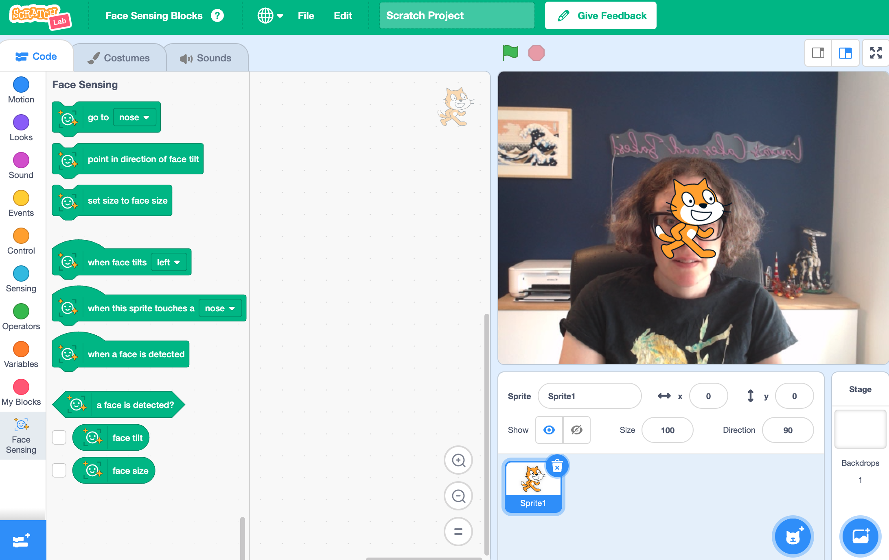

## Set up the project

<iframe width="560" height="315" src="https://www.youtube.com/embed/ny57WfEWhdg?si=-VnKlm2SxVS_WQjh" title="YouTube video player" frameborder="0" allow="accelerometer; autoplay; clipboard-write; encrypted-media; gyroscope; picture-in-picture; web-share" referrerpolicy="strict-origin-when-cross-origin" allowfullscreen></iframe>

This project uses a special experimental version of Scratch called 'Scratch Lab' which has some extra features.

--- task ---

+ Open [Scratch Lab](https://lab.scratch.mit.edu/){:target="_blank"}. 

+ Click on 'Face Sensing'

--- /task ---

--- task ---

+ Click on the 'Try it out' button.

--- /task ---

--- task ---

+ If you are asked for permission to use your webcam, click on 'Allow on every visit'

--- /task ---

You should now see Scratch, with special 'Face sensing' blocks. Your webcam will also be displayed as the stage.

