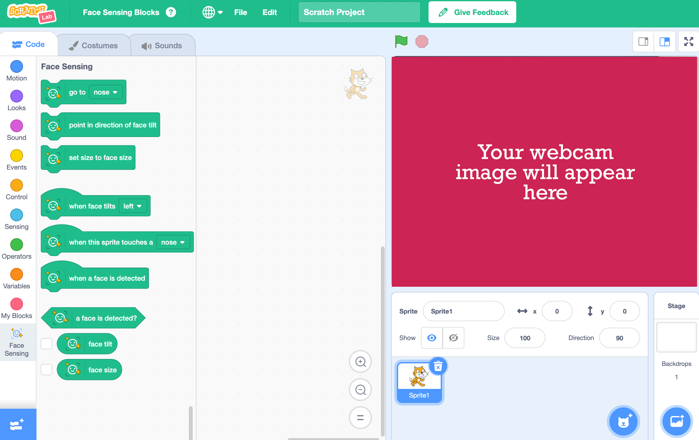

## Set up the project

<html>

<iframe style="position: absolute; top: 0; left: 0; right: 0; width: 100%; height: 100%; border: none;" src="https://www.youtube.com/embed/ERWyBeZh4ac?rel=0&cc_load_policy=1" width="560" height="315" allowfullscreen allow="accelerometer; autoplay; clipboard-write; encrypted-media; gyroscope; picture-in-picture; web-share"></iframe>

</html>

This project uses a special experimental version of Scratch called 'Scratch Lab' which has some extra features.

--- task ---

+ Open [Scratch Lab](https://lab.scratch.mit.edu/){:target="_blank"}. 

+ Click on 'Face Sensing'

--- /task ---

--- task ---

+ Click on the 'Try it out' button.

--- /task ---

--- task ---

+ If you are asked for permission to use your webcam, click on 'Allow on every visit'

--- /task ---

You should now see Scratch, with special 'Face sensing' blocks. Your webcam will also be displayed as the stage.

