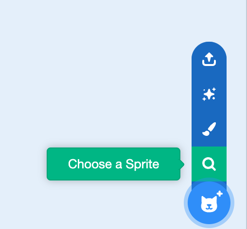

## Move the cheese 

<iframe width="560" height="315" src="https://www.youtube.com/embed/BKgBeqxTrM8?si=VOvkNyg_OEOay1oN" title="YouTube video player" frameborder="0" allow="accelerometer; autoplay; clipboard-write; encrypted-media; gyroscope; picture-in-picture; web-share" referrerpolicy="strict-origin-when-cross-origin" allowfullscreen></iframe>

Make your cheese puffs move randomly around the screen. 

--- task ---

+ Delete the cat sprite

--- /task ---

--- task ---

+ Add a new sprite - you can choose an existing one, upload an image or even paint your own! We chose the cheesy puffs.



--- /task ---

--- task --- 

+ Add some code to make the sprite move to random positions around the screen. 

```blocks3
when flag clicked
show
forever
glide (1) secs to (random position v)
```

--- /task ---

--- task ---

+ **Test:** Click the green flag and check that your sprite moves randomly around the screen to different places.

--- /task ---

