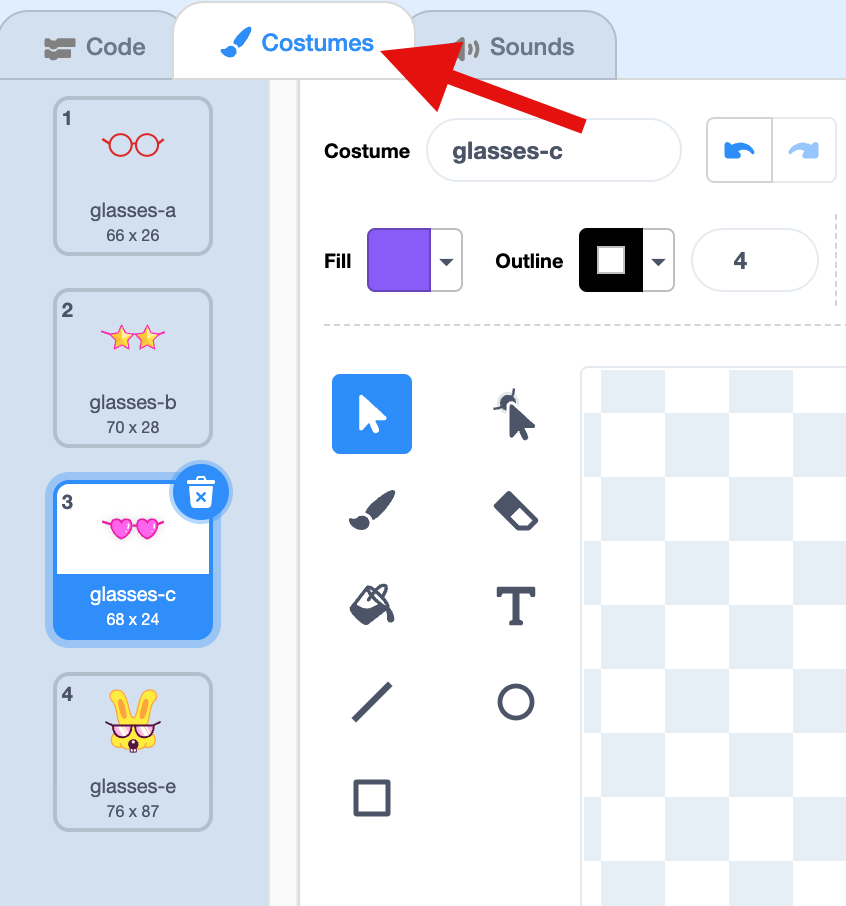
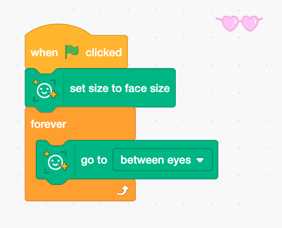
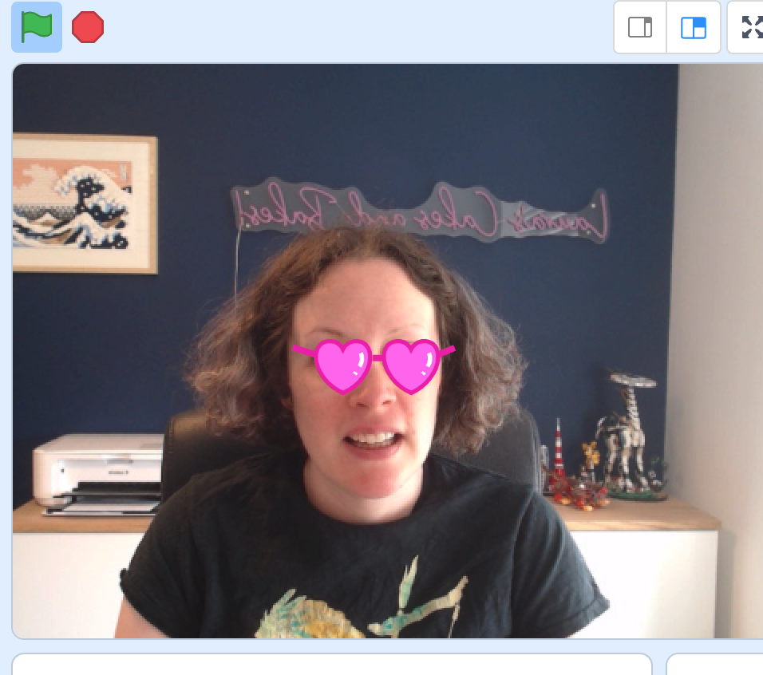

## Silly glasses

The face sensing blocks use a machine learning model to recognise where different parts of your face are on the webcam image. 

Let's try it out!

--- task ---

+ Delete the cat sprite and then click 'Choose a sprite' and choose the glasses.

--- /task ---

--- task ---

+ Click on the 'Costumes' tab and choose your pair of glasses. 

--- /task ---

--- task ---

+ Click on the 'Code' tab and add this code to your glasses sprite

--- /task ---

--- task ---

+ Click the green flag to see your new glasses. Move your head and they will stay in the right place on your face!

--- /task ---