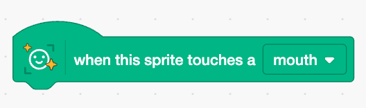

## Chomp the cheese

<html>
<div style="position: relative; width: 100%; overflow: hidden; padding-top: 56.25%;">
<p><iframe style="position: absolute; top: 0; left: 0; right: 0; width: 100%; height: 100%; border: none;" src="https://www.youtube.com/embed/FK11fKJ_q-s?rel=0&cc_load_policy=1" width="560" height="315" allowfullscreen allow="accelerometer; autoplay; clipboard-write; encrypted-media; gyroscope; picture-in-picture; web-share"></iframe></p>
</div>
</html>

When the cheese puffs touch your mouth, they get chomped! 

--- task ---

+ In the code for the cheesy puffs sprite, add a block from the 'Face Sensing' category which detects when the sprite touches a mouth. 



--- /task ---

--- task ---

+ Add some code blocks underneath the face sensing block to make the cheesy puffs disappear when they touch your mouth.

```blocks3
hide
wait (1) seconds
show
```
--- /task ---

--- task ---

+ Click the green flag and have fun trying to catch the cheesy puffs with your mouth!

--- /task ---

