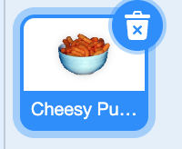

## Move the cheese puffs

Add a new sprite which will move randomly around the screen. When the sprite touches your mouth, it will get eaten! 

--- task ---

+ Add a new sprite - you can choose an existing one, upload an image or even paint your own! We chose the cheese puffs.



--- /task ---

--- task --- 

+ Add some code to make the sprite move to random positions around the screen

```blocks3
+when green flag clicked
show
forever
glide(1) secs to (random position v)
```

--- /task ---

