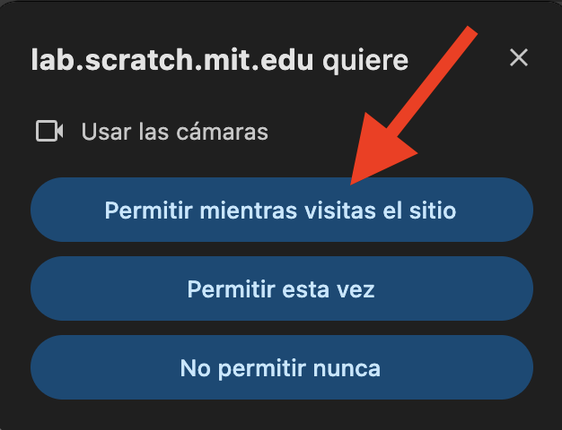
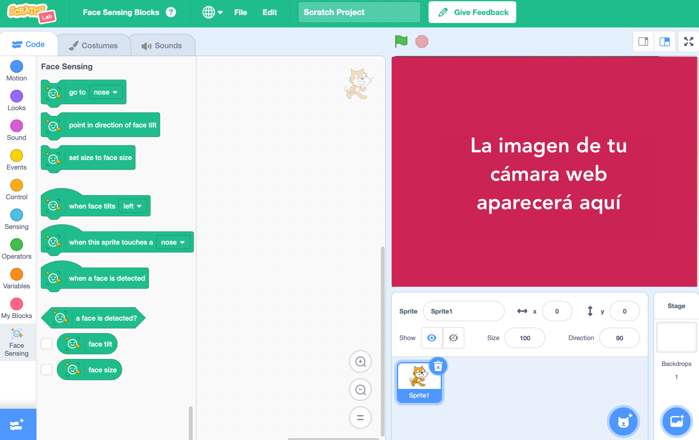

## Configurar el proyecto

<html>
  

    <iframe style="position: absolute; top: 0; left: 0; right: 0; width: 100%; height: 100%; border: none;" src="https://www.youtube.com/embed/aMfd06cIYrs?rel=0&cc_load_policy=1" allowfullscreen allow="accelerometer; autoplay; clipboard-write; encrypted-media; gyroscope; picture-in-picture; web-share"></iframe>
  

</html>

Este proyecto utiliza una versión experimental especial de Scratch llamada Scratch Lab, que tiene algunas características adicionales.

\--- task ---

Abre [Scratch Lab](https://lab.scratch.mit.edu/){:target="_blank"}.

Haz clic en **Detección facial**.

\--- /task ---

\--- task ---

Haz clic en el botón **Pruébalo**.

\--- /task ---

\--- task ---

Si se te pide permiso para usar tu cámara web, haz clic en **Permitir en cada visita**.

\--- /task ---

Ahora deberías ver una versión de Scratch con bloques especiales `Face Sensing`{:class="block3extensions"}. La vista de tu cámara web también se mostrará en el escenario.

