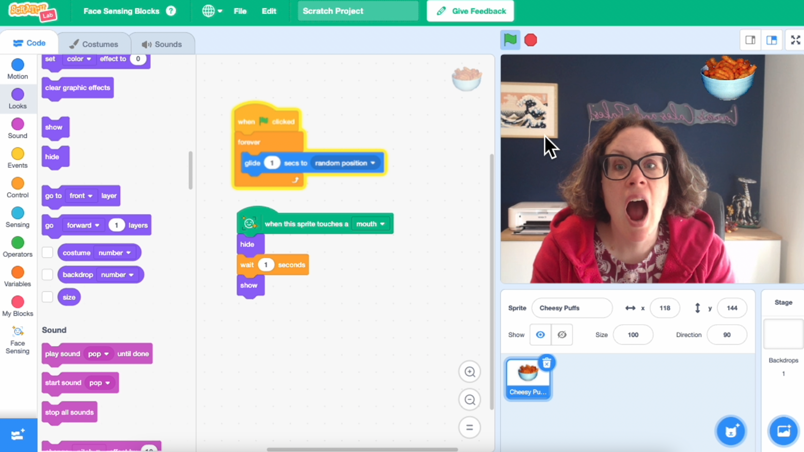

## Ce que tu vas faire

Utilise les outils de reconnaissance faciale de Scratch Lab pour créer un jeu de grignotage de fromage auquel tu joues avec ta bouche !

Tu auras besoin d'une **webcam** pour réaliser ce projet.

## --- collapse ---

## title: Où sont stockées mes images ?

- Ce projet utilise une technologie appelée « apprentissage automatique ». Les systèmes d'apprentissage automatique sont entraînés à l'aide d'une grande quantité de données. Le système d'apprentissage automatique utilisé dans ce projet a déjà été entraîné en utilisant un grand nombre de photos. Tes images ne seront pas utilisées pour l'entraîner.
- Aucune image de ta webcam n'est envoyée à ce site ou à aucun autre site web.

\--- /collapse ---

## --- collapse ---

## title: Pas de YouTube ? Télécharge les vidéos !

Tu peux [télécharger l'ensemble des vidéos de ce projet](https://rpf.io/p/en/chomp-the-cheese-go){:target="_blank"}.

\--- /collapse ---