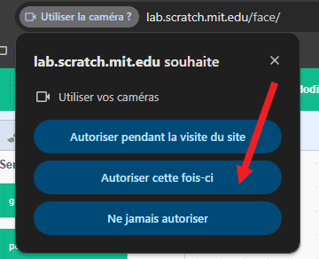
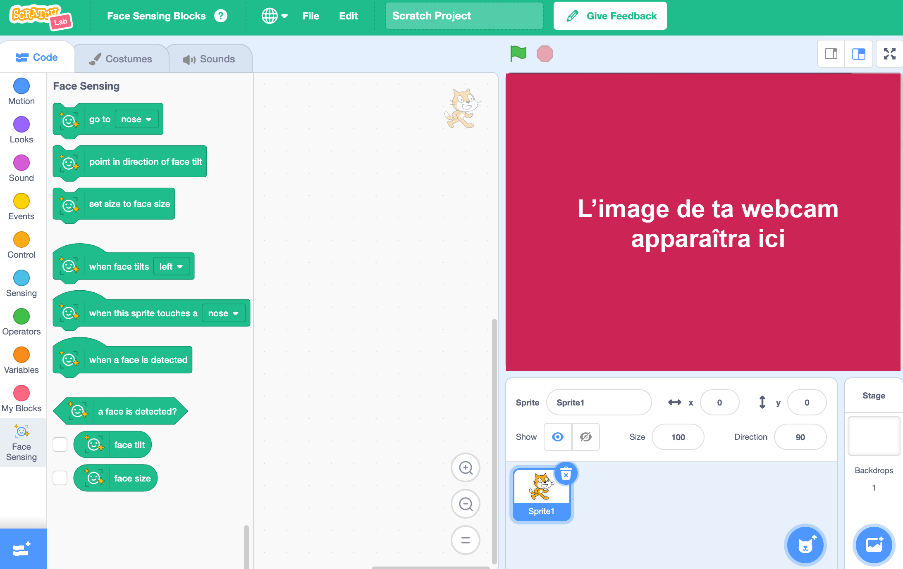

## Configurer le projet

<html>
  

    <iframe style="position: absolute; top: 0; left: 0; right: 0; width: 100%; height: 100%; border: none;" src="https://www.youtube.com/embed/aMfd06cIYrs?rel=0&cc_load_policy=1" allowfullscreen allow="accelerometer; autoplay; clipboard-write; encrypted-media; gyroscope; picture-in-picture; web-share"></iframe>
  

</html>

Ce projet utilise une version expérimentale spéciale de Scratch appelée Scratch Lab, qui possède quelques fonctionnalités supplémentaires.

--- task ---

Ouvre [Scratch Lab](https://lab.scratch.mit.edu/){:target="_blank"}.

Clique sur **Face Sensing**.

--- /task ---

--- task ---

Clique sur le bouton **Try it out**.

--- /task ---

--- task ---

Si l'on te demande l'autorisation d'utiliser ta webcam, clique sur **Autoriser cette fois-ci**.

--- /task ---

Tu devrais maintenant voir une version de Scratch avec des blocs spéciaux `Face Sensing`{:class="block3extensions"}. La vue de ta webcam sera également affichée sur la scène.

