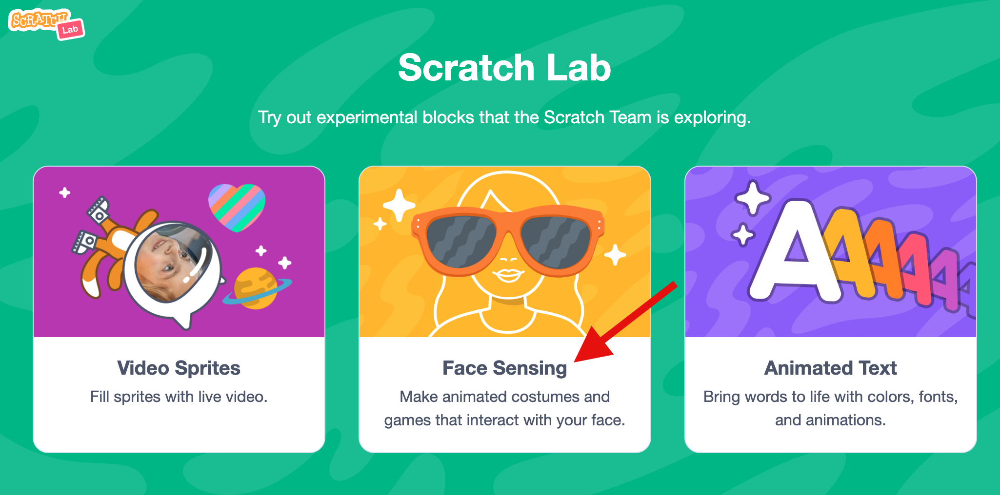
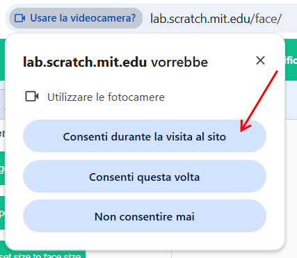
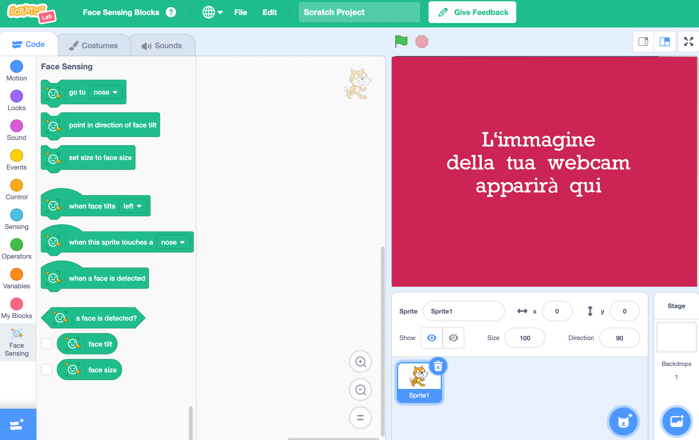

## Imposta il progetto

<html>
  

    <iframe style="position: absolute; top: 0; left: 0; right: 0; width: 100%; height: 100%; border: none;" src="https://www.youtube.com/embed/aMfd06cIYrs?rel=0&cc_load_policy=1" allowfullscreen allow="accelerometer; autoplay; clipboard-write; encrypted-media; gyroscope; picture-in-picture; web-share"></iframe>
  

</html>

Questo progetto utilizza una versione sperimentale speciale di Scratch chiamata Scratch Lab, dotata di alcune funzionalità aggiuntive.

\--- task ---

Apri [Scratch Lab](https://lab.scratch.mit.edu/){:target="_blank"}.

Fai clic su **Face Sensing**.

\--- /task ---

\--- task ---

Fai clic sul pulsante **Try it out**.

\--- /task ---

\--- task ---

Se ti viene chiesto il permesso di utilizzare la webcam, clicca su **Consenti durante la visita al sito**.

\--- /task ---

Ora dovresti vedere una versione di Scratch con i blocchi speciali `Face Sensing`{:class="block3extensions"}. La visuale della tua webcam verrà mostrata anche sullo stage.

