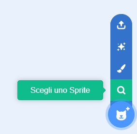

## Sposta il formaggio

<html>
  <div style="position: relative; overflow: hidden; padding-top: 56.25%;">
    <iframe style="position: absolute; top: 0; left: 0; right: 0; width: 100%; height: 100%; border: none;" src="https://www.youtube.com/embed/GIjNO1_LHNo?rel=0&cc_load_policy=1" allowfullscreen allow="accelerometer; autoplay; clipboard-write; encrypted-media; gyroscope; picture-in-picture; web-share"></iframe>
  </div>
</html>

Fai muovere i puff al formaggio in modo casuale sullo schermo.

\--- task ---

Elimina lo sprite **gatto**.

\--- /task ---

\--- task ---

Aggiungi un nuovo sprite. Puoi scegliere uno sprite esistente, caricare un'immagine o persino disegnare il tuo sprite! Abbiamo scelto lo sprite **Cheesy Puffs**.



\--- /task ---

\--- task ---

Aggiungi del codice per far muovere lo sprite in punti a caso sullo schermo:

```blocks3
when flag clicked
forever
glide (1) secs to (random position v)
```

\--- /task ---

\--- task ---

**Test:** fai clic sulla bandierina verde e verifica che il tuo sprite si muova in modo casuale in punti diversi dello schermo.

\--- /task ---
