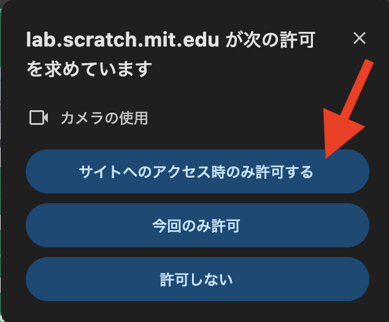
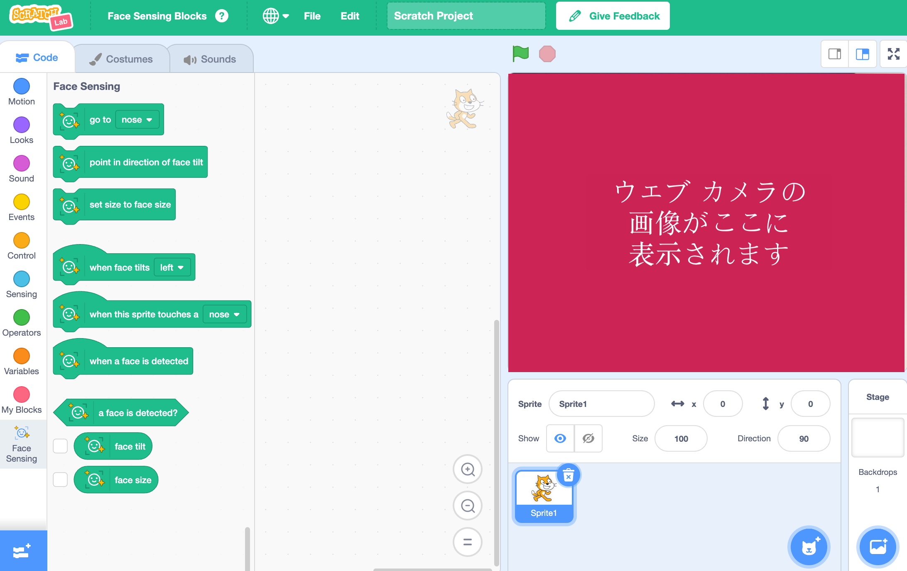

## プロジェクトの設定

<html>
  

    <iframe style="position: absolute; top: 0; left: 0; right: 0; width: 100%; height: 100%; border: none;" src="https://www.youtube.com/embed/aMfd06cIYrs?rel=0&cc_load_policy=1" allowfullscreen allow="accelerometer; autoplay; clipboard-write; encrypted-media; gyroscope; picture-in-picture; web-share"></iframe>
  

</html>

このプロジェクトでは、Scratch Lab と呼ばれる特別な実験版を使用しています。これにはいくつかの機能があります。

\--- task ---

[Scratch Lab] (https://lab.scratch.mit.edu/){:target="_blank"}を開きます。

**顔認識**をクリックします。

\--- /task ---

\--- task ---

**試してみる** ボタンをクリックします。

\--- /task ---

\--- task ---

ウェブカメラの使用許可を求められた場合は、[**毎回許可**] をクリックします。

\--- /task ---

特別な「顔認識」{:class="block3extensions"}ブロックを使った Scratch のバージョンが表示されるはずです。 ステージにはウェブカメラからの映像も表示されます。

