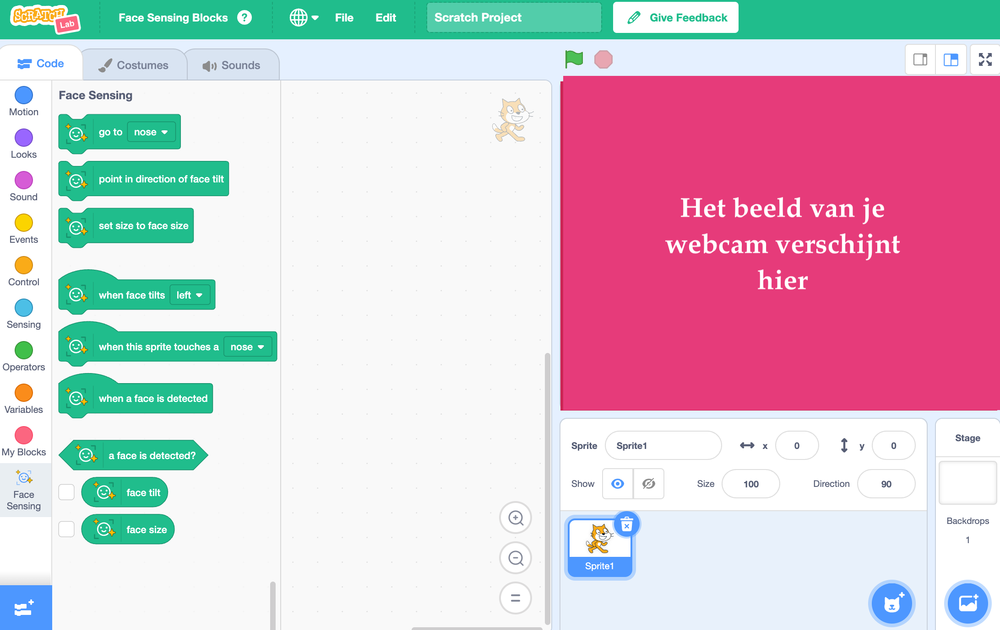

## Het project opzetten

<html>
  

    <iframe style="position: absolute; top: 0; left: 0; right: 0; width: 100%; height: 100%; border: none;" src="https://www.youtube.com/embed/aMfd06cIYrs?rel=0&cc_load_policy=1" allowfullscreen allow="accelerometer; autoplay; clipboard-write; encrypted-media; gyroscope; picture-in-picture; web-share"></iframe>
  

</html>

Dit project maakt gebruik van een speciale experimentele versie van Scratch, genaamd Scratch Lab, die een aantal extra functies heeft.

\--- task ---

Open [Scratch Lab](https://lab.scratch.mit.edu/){:target="_blank"}.

Klik op **Gezichtsdetectie**.

\--- /task ---

\--- task ---

Klik op de **Probeer het uit** knop.

\--- /task ---

\--- task ---

Als er toestemming wordt gevraagd om je webcam te gebruiken, klik dan op **Toestaan bij elk bezoek**.

\--- /task ---

Je zou nu een versie van Scratch moeten zien met speciale `Face Sensing` (Gezichtsdetectie){:class="block3extensions"} blokken. De weergave van je webcam wordt ook weergegeven in het speelveld.

