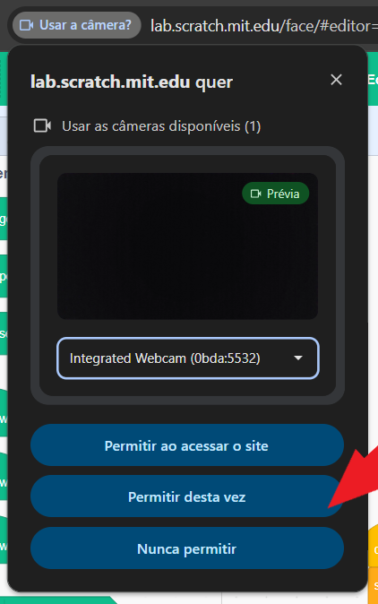
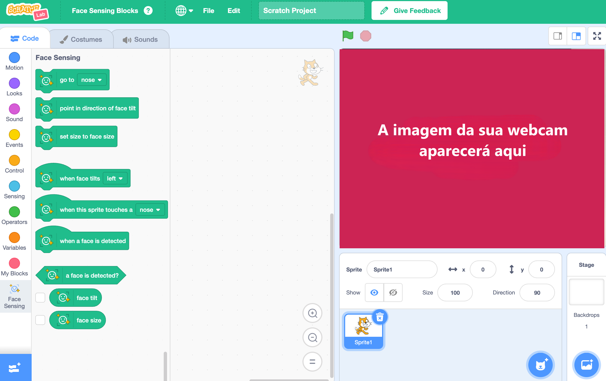

## Configurar o projeto

<html>
  

    <iframe style="position: absolute; top: 0; left: 0; right: 0; width: 100%; height: 100%; border: none;" src="https://www.youtube.com/embed/aMfd06cIYrs?rel=0&cc_load_policy=1" allowfullscreen allow="accelerometer; autoplay; clipboard-write; encrypted-media; gyroscope; picture-in-picture; web-share"></iframe>
  

</html>

Este projeto usa uma versão experimental especial do Scratch chamada Scratch Lab, que tem alguns recursos extras.

\--- task ---

Abra o [Scratch Lab](https://lab.scratch.mit.edu/){:target="_blank"}.

Clique em **Detecção Facial**.

\--- /task ---

\--- task ---

Clique no botão **Experimente**.

\--- /task ---

\--- task ---

Se for solicitado permissão para usar sua webcam, clique em **Permitir em todas as visitas**.

\--- /task ---

Agora você deve ver uma versão do Scratch com blocos especiais de `Detecção Facial`{:class="block3extensions"}. A imagem da sua câmera também será exibida no Palco.

