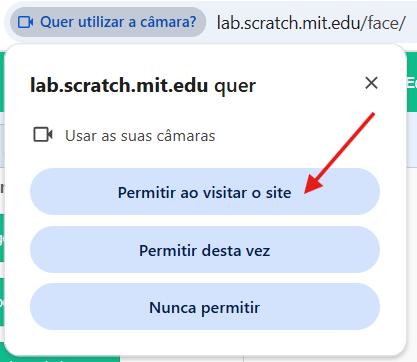
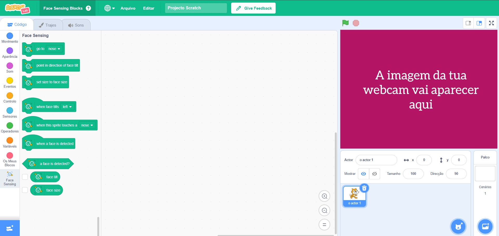

## Preparar o modelo

<html>
  

    <iframe style="position: absolute; top: 0; left: 0; right: 0; width: 100%; height: 100%; border: none;" src="https://www.youtube.com/embed/aMfd06cIYrs?rel=0&cc_load_policy=1" allowfullscreen allow="accelerometer; autoplay; clipboard-write; encrypted-media; gyroscope; picture-in-picture; web-share"></iframe>
  

</html>

Este projeto usa uma versão especial experimental do Scratch chamada Scratch Lab que tem alguns recursos extra.

\--- task ---

Abre o [Scratch Lab](https://lab.scratch.mit.edu/){:target="_blank"}.

Clica em **Detecção de Rosto**.

\--- /task ---

\--- task ---

Clica no botão **Experimente**.

\--- /task ---

\--- task ---

Se te for pedido permissão para usar a webcam, clica em **Permitir ao visitar o site**.

\--- /task ---

Deves ver agora uma versão do Scratch com os blocos especiais `Detecção de Rosto` {:class="block3extensions"}. A visualização da tua webcam será também exibida no Palco.

