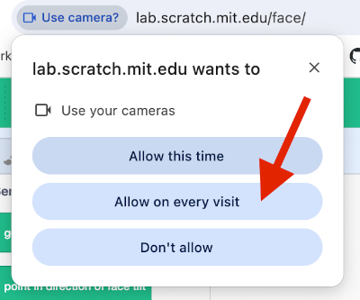
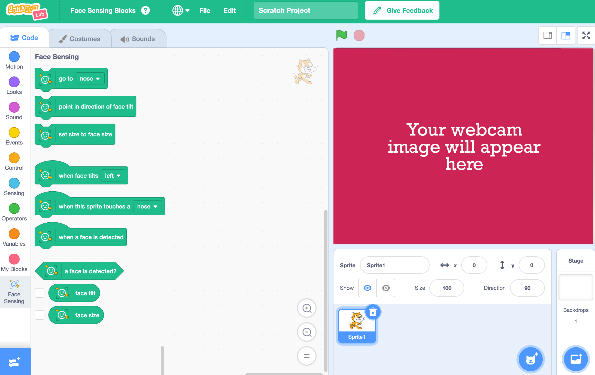

## Створи проєкт

<html>
  

    <iframe style="position: absolute; top: 0; left: 0; right: 0; width: 100%; height: 100%; border: none;" src="https://www.youtube.com/embed/aMfd06cIYrs?rel=0&cc_load_policy=1" allowfullscreen allow="accelerometer; autoplay; clipboard-write; encrypted-media; gyroscope; picture-in-picture; web-share"></iframe>
  

</html>

У цьому проєкті використовується спеціальна експериментальна версія Скретчу під назвою Scratch Lab («Лабораторія Скретчу»), яка має деякі додаткові функції.

--- task ---

Відкрий [Scratch Lab](https://lab.scratch.mit.edu/){:target="_blank"}.

Натисни на **Face Sensing** («Розпізнавання обличчя»).

--- /task ---

--- task ---

Натисни кнопку **Try it out** («Спробувати»).

--- /task ---

--- task ---

Якщо браузер запитає дозвіл на використання твоєї вебкамери, натисни **Дозволити під час кожного відвідування**.

--- /task ---

Тепер ти маєш побачити версію Скретчу зі спеціальними блоками `Face Sensing`{:class="block3extensions"} («розпізнавання обличчя»). Вид з твоєї вебкамери також буде відображатися на Сцені.

