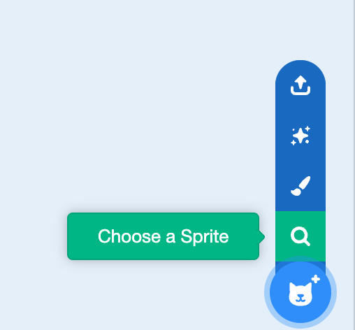

## Рухай сирні палички

<html>
  <div style="position: relative; overflow: hidden; padding-top: 56.25%;">
    <iframe style="position: absolute; top: 0; left: 0; right: 0; width: 100%; height: 100%; border: none;" src="https://www.youtube.com/embed/GIjNO1_LHNo?rel=0&cc_load_policy=1" allowfullscreen allow="accelerometer; autoplay; clipboard-write; encrypted-media; gyroscope; picture-in-picture; web-share"></iframe>
  </div>
</html>

Зробіть так, щоб сирні палички довільно рухалися по екрану.

--- task ---

Видали спрайт кота.

--- /task ---

--- task ---

Додай новий спрайт. Ти можеш вибрати спрайт з колекції, завантажити зображення або навіть намалювати власний спрайт! Ми вибрали спрайт **Cheesy Puffs** («Сирні палички»).



--- /task ---

--- task --- 

Додай код, щоб спрайт переміщався в довільні місця на екрані:

```blocks3
when flag clicked
forever
glide (1) secs to (random position v)
```

--- /task ---

--- task ---

**Протестуй:** натисни на зелений прапорець і перевір, чи спрайт переміщується по екрану випадковим чином.

--- /task ---
