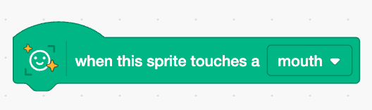

## Хрумай сирні палички

<html>
  <div style="position: relative; overflow: hidden; padding-top: 56.25%;">
    <iframe style="position: absolute; top: 0; left: 0; right: 0; width: 100%; height: 100%; border: none;" src="https://www.youtube.com/embed/zXqucb5EidA?rel=0&cc_load_policy=1" allowfullscreen allow="accelerometer; autoplay; clipboard-write; encrypted-media; gyroscope; picture-in-picture; web-share"></iframe>
  </div>
</html>

Зроби так, щоб гравець їв сирні палички, коли вони торкатимуться його рота на екрані!

--- task ---

У код для спрайта **Cheesy Puffs** додай блок із меню `Face Sensing`{:class="block3extensions"}, щоб визначати, коли спрайт торкається рота:



--- /task ---

--- task ---

Додай ці декілька блоків коду під блок `Face Sensing`{:class="block3extensions"}, щоб сирні палички зникали, коли вони торкаються рота:

```blocks3
hide
wait (1) seconds
show
```

--- /task ---

--- task ---

Натисни на зелений прапорець і спробуй зловити сирні палички ротом!

--- /task ---
