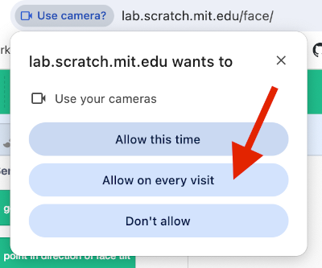
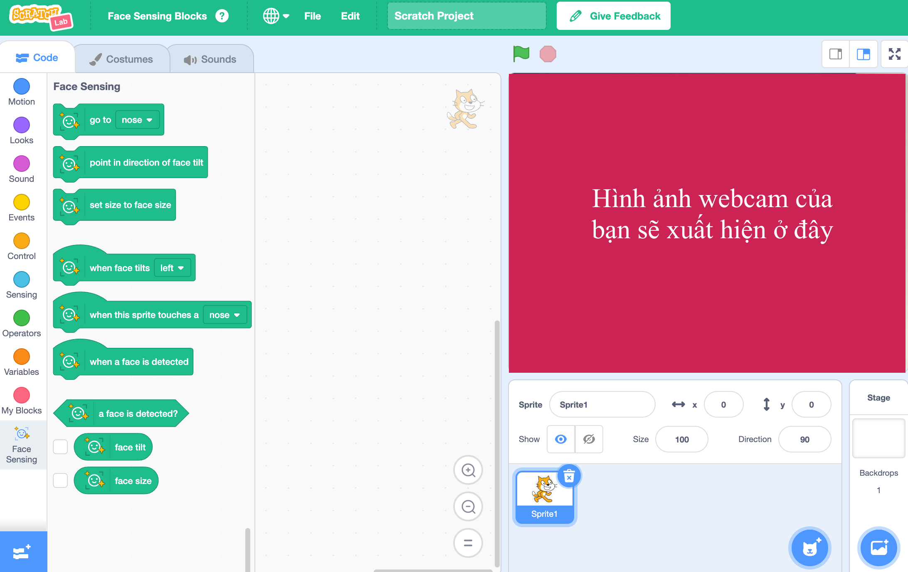

## Thiết lập dự án

<html>
  

    <iframe style="position: absolute; top: 0; left: 0; right: 0; width: 100%; height: 100%; border: none;" src="https://www.youtube.com/embed/aMfd06cIYrs?rel=0&cc_load_policy=1" allowfullscreen allow="accelerometer; autoplay; clipboard-write; encrypted-media; gyroscope; picture-in-picture; web-share"></iframe>
  

</html>

Dự án này sử dụng phiên bản thử nghiệm đặc biệt của Scratch có tên là Scratch Lab, có một số tính năng bổ sung.

\--- task ---

Mở [Scratch Lab](https://lab.scratch.mit.edu/){:target="_blank"}.

Nhấp vào **Cảm biến khuôn mặt**.

\--- /task ---

\--- task ---

Nhấp vào nút **Dùng thử**.

\--- /task ---

\--- task ---

Nếu bạn được yêu cầu cấp quyền sử dụng webcam, hãy nhấp vào **Cho phép mỗi lần truy cập**.

\--- /task ---

Bây giờ bạn sẽ thấy phiên bản Scratch có các khối `Face Sensing`{:class="block3extensions"} đặc biệt. Hình ảnh từ webcam của bạn cũng sẽ được hiển thị trên Stage.

